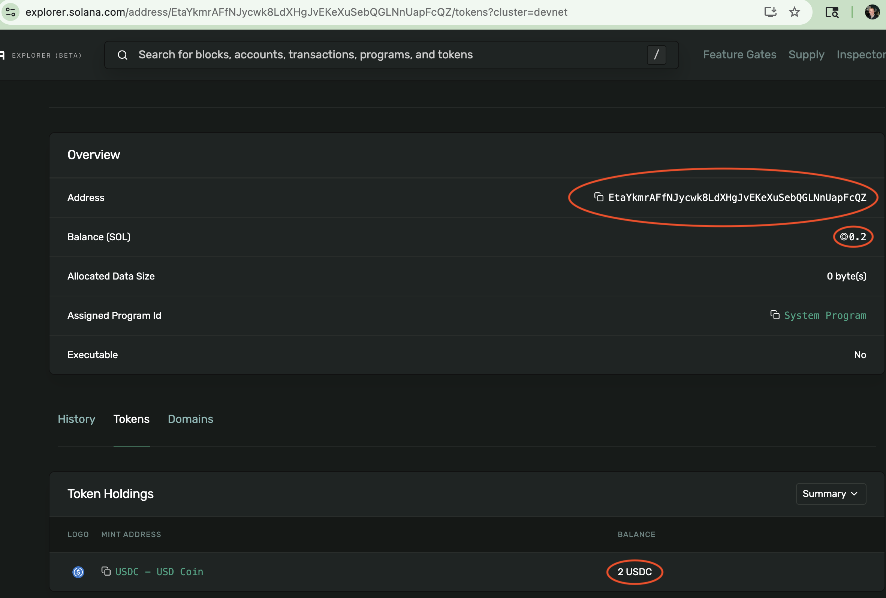
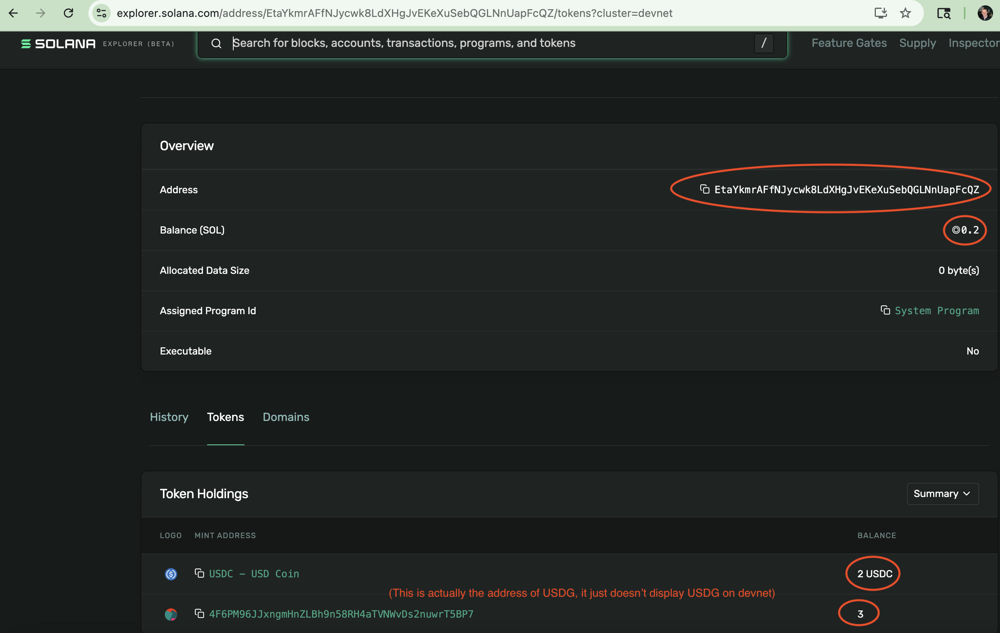

# No Code EVM and Solana Agent using the DSPy AI Framework

<p align="center">
  
  
</p>

<p align="center">
  
  
  
</p>


This Python project leverages DSPy to enable an AI agent to reason over a curated set of primitive functions related to multi-chain wallet creation and token transfers. The agent supports both Solana (USDC, PYUSD, USDG) and Ethereum chains (ETH, USDC, PYUSD). The agent is guided by natural language instructions that define the task and constraints. Without any hardcoded logic, it determines which functions to call—and in what order—to fulfill the user's request autonomously across multiple blockchain networks.

## Table of Contents

- [What is DSPy?](#what-is-dspy)
- [Working Example](#working-example)
  - [Basic Solana wallet creation and funding [with screenshots]](#basic-solana-wallet-creation-and-funding-with-screenshots)
  - [How it works [Short Version]](#how-it-works-short-version)
- [How it works [Detailed]](#how-it-works-detailed)
  - [Overview](#overview)
  - [DSPy Modules](#dspy-modules)
    - [Solana Primitive Functions](#solana-primitive-functions)
    - [EVM Primitive Functions](#evm-primitive-functions)
  - [Agent Behavior Rules for Solana](#agent-behavior-rules-for-solana)
  - [Agent Behavior Rules for EVM](#agent-behavior-rules-for-evm)
- [Prerequisites](#prerequisites)
- [Setup](#setup)
  - [Setup if you have a Solana funding wallet already with Sol, USDC, PYUSD, USDG on devnet](#setup-if-you-have-a-solana-funding-wallet-already-with-sol-usdc-pyusd-usdg-on-devnet)
  - [Setup if you have an Ethereum funding wallet already with Eth, USDC, PYUSD, USDG on Sepolia](#setup-if-you-have-an-ethereum-funding-wallet-already-with-eth-usdc-pyusd-usdg-on-sepolia)
  - [Setup completely from scratch with no solana and ethereum funding wallet](#setup-completely-from-scratch-with-no-solana-and-ethereum-funding-wallet)
- [Usage](#usage)
- [Tests](#tests)
- [Notes](#notes)

## What is DSPy?

DSPy is a framework for building modular, composable AI systems using declarative "programs" written in Python. Instead of hardcoding logic, developers define tasks in plain language along with a small set of callable functions (called "modules" or "tools"), and DSPy uses language models to decide how to orchestrate these functions to achieve the desired outcome. It handles reasoning, planning, and function selection dynamically, making it ideal for building intelligent agents that can adapt to new instructions or workflows without manual rewrites.

## Working Example

### Basic Solana wallet creation and funding [with screenshots]

The best way to illustrate this is through an example: creating a wallet, funding it with SOL and USDC, and then formatting the output.

```python
>>> result = agent_basic(user_request="""
    Create a solana new wallet. This will be the user wallet. Fund it with 0.2 sol. 
    Make sure to also fund it with 2 USDC. Return me data in the following format: 
    user_wallet_public_key={user_wallet_public_key},sol_amount:{sol_amount},usdc_amount={usdc_amount}. 
    Make sure that the formattin is in 3 decimal places.
""")
```

When inspecting result you see the correct formatted result that was requested:

```python
>>> result.process_result
user_wallet_public_key=EtaYkmrAFfNJycwk8LdXHgJvEKeXuSebQGLNnUapFcQZ,
sol_amount:0.200,
usdc_amount=2.000
```

By visiting the public key on the Solana Explorer (Devnet), you'll see that the agent successfully executed the entire workflow from a single command in english speak:



Let's fund this wallet now with 3 USDG:

```python
>>> result = agent_basic(user_request="""
Use the user wallet we just created and send it 3 USDG from the funding wallet"
""")
```

This time, no explicit output format was specified—so the agent clearly explains the steps it took to complete the task.

```python
>>> result.process_result
'Successfully sent 3 USDG from the funding wallet to the user wallet. The associated token account for USDG was created prior to the transfer.'
```

By navigating to the same public key on Devnet, you'll see that 3 USDG was successfully funded.



### How it works [Short Version]

In [agent_tools_solana.py](src/dspy_agents/agent_tools_solana.py) notice that there are only 6 functions:

```python
   create_solana_wallet,
   create_solana_associated_token_account_for_token,
   fund_solana_user_wallet_with_sol_from_devnet,
   send_solana_token_from_funding_wallet,
   get_last_solana_user_wallet_created,
   get_last_solana_user_wallet_balance,
```

There is also a description of the behavior of the user agent in [agent_basic.py](src/dspy_agents/agent_basic.py):

```python
    You are the Multi-Chain Crypto Wallet Administrator

    References to stablecoin and stablecoins include PYUSD, USDG, and USDC.

    You are equipped with a set of tools to manage Solana and EVM wallets and handle token 
    operations. Your available functions include:

    Solana Functions:
    * Create a new Solana wallet
    * Create an associated token account for Solana stablecoins
    * Send SOL and stablecoins from the Solana funding wallet to the user wallet
    * Get the public key of the last Solana user wallet created
    * Get the SOL and stablecoins balance of the last Solana user wallet
    .....
```

The user agent will use the functions provided to decide how to execute the user_request. This is all done in a code-less way. You are able to add any english-speak constraints to the agent. An example of one that is added to the agent in [agent_basic.py](src/dspy_agents/agent_basic.py) is:

```python
     * For USDG if the transfer request and the current USDG balance eqaul to 6 or more, do not allow the transfer 
     and error with the message: "You are being greedy. You cannot have more than 5 USDG".
     * Do not allow a single USDG transfer of 4 or more. If attempted, respond 
     with: "You are a thief. You cannot transfer 4 or USDG more at once."
```

** For a detailed explanation of all DSPy modules and their functions, see [How it works [Detailed]](#how-it-works-detailed).**

## How it works [Detailed]

### Overview

The DSPy agent interprets user intent expressed in natural English and selects from a set of modular primitive functions (also known as tools) to fulfill the request.

```python
agent = dspy.ReAct(
    DSPyWalletServiceSericeBasic,
    tools=[
        # Solana tools
        create_solana_wallet,
        create_solana_associated_token_account_for_token,
        fund_solana_user_wallet_with_sol_from_devnet,
        send_solana_token_from_funding_wallet,
        get_last_solana_user_wallet_created,
        get_last_solana_user_wallet_balance,
        
        # EVM tools
        create_evm_wallet,
        send_evm_token_from_funding_wallet,
        get_last_evm_user_wallet_created,
        get_last_evm_user_wallet_balance,
    ]
) 
```

### DSPy Modules 

#### **Solana Primitive Functions**

The agent has access to the following primitive functions that handle all Solana wallet operations:

#### Wallet Management
- **`create_solana_wallet()`** - Creates a new Solana wallet and returns the public key. This function generates a new keypair and stores it for future reference.

#### Token Account Management
- **`create_solana_associated_token_account_for_token()`** - Creates a new associated token account for the given public key and token type. This allows the wallet to hold specific tokens (USDC, PYUSD, or USDG). Fees are paid from the funding wallet.

#### Funding Operations
- **`fund_solana_user_wallet_with_sol_from_devnet()`** - Funds a user wallet with SOL from the devnet faucet. This is the preferred method for SOL funding when no specific funding source is mentioned.
- **`send_solana_token_from_funding_wallet()`** - Sends tokens (SOL, USDC, PYUSD, or USDG) from the configured funding wallet to the user wallet. This function handles both SOL and token transfers.

#### Wallet Information
- **`get_last_solana_user_wallet_created()`** - Returns the public key of the last user wallet that was created. This is used to reference the most recently created wallet.
- **`get_last_solana_user_wallet_balance()`** - Gets the current balance of a specific token type for the last user wallet created. Supports SOL, USDC, PYUSD, and USDG.

### **EVM Primitive Functions**

The agent also has access to the following primitive functions that handle all EVM wallet operations:

#### Wallet Management
- **`create_evm_wallet()`** - Creates a new Ethereum wallet and returns the public key. This function generates a new keypair and stores it for future reference.

#### Funding Operations
- **`send_evm_token_from_funding_wallet()`** - Sends tokens (ETH, USDC, PYUSD) from the configured Ethereum funding wallet to the user wallet. This function handles both ETH and token transfers.

#### Wallet Information
- **`get_last_evm_user_wallet_created()`** - Returns the public key of the last Ethereum user wallet that was created. This is used to reference the most recently created EVM wallet.
- **`get_last_evm_user_wallet_balance()`** - Gets the current balance of a specific token type for the last Ethereum user wallet created. Supports ETH, USDC, and PYUSD.

### **Agent Behavior Rules for Solana**

The DSPy agent follows these key rules when processing Solana requests:

**For New Wallet Creation:**
- If no funding option is specified, try devnet faucet first, then use funding wallet if faucet fails
- For SOL funding, always try devnet faucet first before using funding wallet
- Default SOL amount from faucet is 0.05 SOL if not specified
- If funding wallet is explicitly mentioned, use funding wallet instead of faucet

**For Existing Wallets:**
- Use the last created user wallet (don't create new ones)
- Support funding with SOL, USDC, PYUSD, or USDG
- Use funding wallet (not devnet faucet) for existing wallets

**Important Constraints:**
- Create associated token accounts before sending tokens
- Only provide funding wallet public key when explicitly requested
- Never disclose private keys

### **Agent Behavior Rules for EVM**

Agent behavior for EVM is much more basic and simplified. See the agent description in [agent_basic.py](src/dspy_agents/agent_basic.py) for agent behavior.


## Prerequisites

- Python 3.7 or higher
- pip (Python package manager)

## Setup 

### Setup if you have a Solana funding wallet already with Sol, USDC, PYUSD, USDG on devnet

1. Clone this repository
2. Create virtual vwnc
   ```bash
   python -m venv venv
   ```
3. Create a `.env` file in the project root with your funding wallet private key:
   ```
   SOLANA_FUNDING_WALLET_PRIVATE_KEY={your_private_key_here}
   SOLANA_FUNDING_WALLET_PUBLIC_KEY={your_public_key_here}
   OPENAI_API_KEY={your_openai_api_key_here}
   ```
4. Make sure that your SOLANA_FUNDING_WALLET has SOL, USDC, PYUSD, and USDG funded on devnet
5. Activate the virtual env
   ```bash
   source venv/bin/activate
   ```
6. Install all dependencies 
   ```bash
   pip install -r requirements.txt
   ```
7. Install the current directory as a python package to be able to be used in a python shell
   ```bash
   pip install -e .
   ```

### Setup if you have an Ethereum funding wallet already with Eth, USDC, PYUSD, USDG on Sepolia

1. Clone this repository
2. Create virtual vwnc
   ```bash
   python -m venv venv
   ```
3. Create a `.env` file in the project root with your funding wallet private key:
   ```
   EVM_FUNDING_WALLET_PRIVATE_KEY={your_private_key_here}
   OPENAI_API_KEY={your_openai_api_key_here}
   ```
4. Make sure that your EVM_FUNDING_WALLET_PRIVATE_KEY ETH, PYUSD, USDC, and USDG funded 
5. Activate the virtual env
   ```bash
   source venv/bin/activate
   ```
6. Install all dependencies 
   ```bash
   pip install -r requirements.txt
   ```
7. Install the current directory as a python package to be able to be used in a python shell
   ```bash
   pip install -e .
   ```

### Setup completely from scratch with no solana and ethereum funding wallet

1. Clone this repository
2. Create virtual vwnc
   ```bash
   python -m venv venv
   ```
3. Create a `.env` file in the project root with only your OPEN AI API Key:
   ```
   OPENAI_API_KEY={your_openai_api_key_here}
   ```
4. Activate the virtual env
   ```bash
   source venv/bin/activate
   ```
5. Install all dependencies 
   ```bash
   pip install -r requirements.txt
   ```
6. Install the current directory as a python package to be able to be used in a python shell
   ```bash
   pip install -e .
   ```
7. Enter a python shell 
   ```bash
   python
   ```
8. Execute against the agent to create you a wallet from scratch and return you the public and private key:
```python
>>> from dspy_agents.agent_basic import *
>>> result = agent_basic(user_request="Create a new solana wallet and evm wallet. Return me the private and public key of the solana wallet and evm wallet in this format: solana_public_key={solana_public_key}, solana_private_key={solana_private_key},evm_public_key={evm_public_key},evm_private_key={evm_private_key}. You have permission to disclose it.")
>>> print(result.process_result)
Output:
solana_public_key=[HIDDEN FOR THE README], solana_private_key=[HIDDEN FOR THE README], evm_public_key=[HIDDEN FOR THE README], evm_private_key=[HIDDEN FOR THE README], 
```
9. Exit the python shell. The solana and evm public_key and private_key that was returned, add it to the .env file alongside the OPENAI_API_KEY:
   ```bash
   SOLANA_FUNDING_WALLET_PRIVATE_KEY={your_solana_private_key_here}
   SOLANA_FUNDING_WALLET_PUBLIC_KEY={your_solana_public_key_here}
   OPENAI_API_KEY={your_openai_api_key_here}
   EVM_FUNDING_WALLET_PRIVATE_KEY={your_evm_private_key_here}
   ```
10. With the public key visit the following faucet websites for funding. These websites may have moved at the time you read this, so use google to find the proper faucet website. At the time of writing, these websites are valid:
* Solana: https://faucet.solana.com/
* Eth: https://cloud.google.com/application/web3/faucet/ethereum/sepolia 
* USDG and PYUSD: https://faucet.paxos.com/ 
* USDC: https://faucet.circle.com/

## Usage

1. Complete the [Setup](#setup) to set-up the .env, create the virtual envrionment, activate the venv, install dependencies.
2. Enter a python shell 
   ```bash
   python
   ```
3. Import everything so you can access the agent 
```python
>>> from dspy_agents.agent_basic import *
>>> result = agent_basic(user_request="create me a new solana wallet. Return me the key.")
>>> print(result.process_result)
```
4. You can execute everything from [Working Example](#working-example)

## Tests

```bash
python -m venv venv
source venv/bin/activate
pip install -r requirements.txt
python -m pytest # For simple test case output
python -m pytest -v -s # For test cast output with detailed logging
```

Note: One test will be skipped by default—this is an end-to-end integration test that interacts with the live Solana Devnet faucet. Due to rate limits, it can only be run occasionally. To run it, you must explicitly call it, run the following command on the command line:

```bash
python -m pytest tests/test_faucet_integration.py -v -s
```

## Notes

- The agent by default works against devnet, change environment in [config.py](src/dspy_solana_wallet/config.py)
- Make sure your funding wallet has enough SOL, USDC, PYUSD, and USDG tokens on devnet
- Keep your private keys secure and never commit them to version control
- Token transfers for USDG and PYUSD leverage the Token-2022 program, while USDC transfers use the standard SPL Token program and associated libraries
- In Solana, to recieve either a SPL token or Token-2022 token, you must create an Associated Token Account, this the agent does that.


